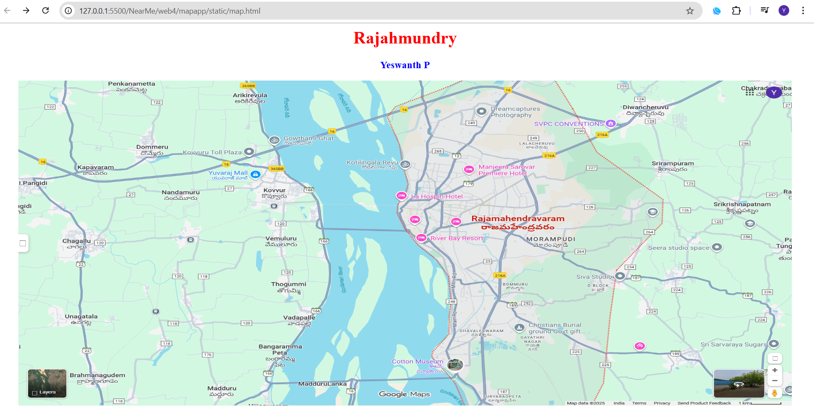
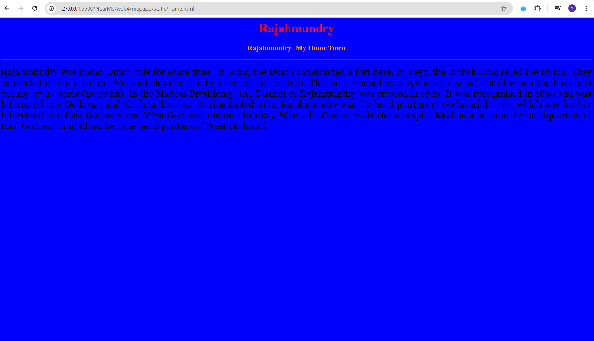
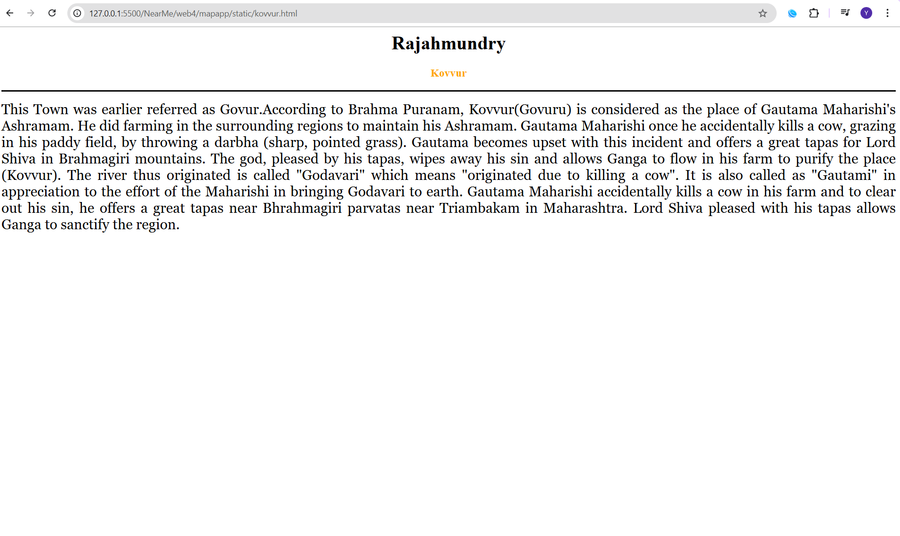

# Ex04 Places Around Me

## Date: 23-10-2025

## AIM
To develop a website to display details about the places around my house.

## DESIGN STEPS

### STEP 1
Create a Django admin interface.

### STEP 2
Download your city map from Google.

### STEP 3
Using ```<map>``` tag name the map.

### STEP 4
Create clickable regions in the image using ```<area>``` tag.

### STEP 5
Write HTML programs for all the regions identified.

### STEP 6
Execute the programs and publish them.

## CODE
```
map.html
<html>
<head>
    <title>My City</title>
</head>
<body>
    <h1 align="center">
        <font color="red"><b>Rajahmundry</b></font>
    </h1>
    <h3 align="center">
        <font color="blue"><b>Yeswanth P</b></font>
    </h3>
    <center>
        
        <map name="MyCity">
        <area shape="rect" coords="700,200,1000,400" href="home.html" title="My Home Town">
        <area shape="rect" coords="650,600,900,400" href="cottonmuseum.html" title="Museum">
        <area shape="circle" coords="100,50,800,350" href="kovvur.html" title="Kovvur">
        </map>
    </center>
</body>
</html>

home.html
<html>
<head>
    <title>My Home Town</title>
</head>
<body bgcolor="blue">
<h1 align="center">
<font color="red"><b>Rajahmundry</b></font>
</h1>
<h3 align="center">
<font color="orange"><b>Rajahmundry -My Home Town</b></font>
</h3>
<hr size="3" color="red">
<p align="justify">
<font face="Georgia" size="5">
Rajahmundry was under Dutch rule for some time. In 1602, the Dutch constructed a fort 
here. In 1857, the British conquered the Dutch. They converted it into a jail in 1864 
and elevated it into a central jail in 1870. The jail is spread over 196 acres (79 ha) 
out of which the buildings occupy 37.24 acres (15.07 ha).

In the Madras Presidency, the District of Rajahmundry was created in 1823.
It was reorganised in 1859 and was bifurcated into Godavari and Krishna districts. 
During British rule, Rajahmundry was the headquarters of Godavari district, which was 
further bifurcated into East Godavari and West Godavari districts in 1925. When the Godavari 
district was split, Kakinada became the headquarters of East Godavari and Eluru became 
headquarters of West Godavari.
</p>
</body>
</html>

kovvur.html
<html>
<head>
    <title>My Home Town</title>
</head>
<body bgcolor="white">
<h1 align="center">
<font color="black"><b>Rajahmundry</b></font>
</h1>
<h3 align="center">
<font color="orange"><b>Kovvur</b></font>
</h3>
<hr size="3" color="black">
<p align="justify">
<font face="Georgia" size="5">
This Town was earlier referred as Govur.According to Brahma Puranam, 
Kovvur(Govuru) is considered as the place of Gautama Maharishi's Ashramam. 
He did farming in the surrounding regions to maintain his Ashramam. Gautama Maharishi 
once he accidentally kills a cow, grazing in his paddy field, by throwing a darbha 
(sharp, pointed grass). Gautama becomes upset with this incident and offers a great 
tapas for Lord Shiva in Brahmagiri mountains. The god, pleased by his tapas, wipes 
away his sin and allows Ganga to flow in his farm to purify the place (Kovvur). 
The river thus originated is called "Godavari" which means "originated due to killing a 
cow". It is also called as "Gautami" in appreciation to the effort of the Maharishi 
in bringing Godavari to earth. Gautama Maharishi accidentally kills a cow in his farm and 
to clear out his sin, he offers a great tapas near Bhrahmagiri parvatas near 
Triambakam in Maharashtra. Lord Shiva pleased with his tapas allows Ganga to 
sanctify the region.
</p>
</body>
</html>

cottonmuseum.html
<html>
<head>
    <title>My Home Town</title>
</head>
<body bgcolor="orange">
<h1 align="center">
<font color="black"><b>Rajahmundry</b></font>
</h1>
<h3 align="center">
<font color="grey"><b>Sir Aurthur Cottom Museum</b></font>
</h3>
<hr size="3" color="black">
<p align="justify">
<font face="Georgia" size="5">
Sir Arthur Cotton Museum was inaugurated by the Honarble Chief Minister of Andhra Pradesh 
Sri Nadamuri Tarakarama Rao on 25.2.1988 and the Museum is located in the building which 
was previously under the occupation of Executive Engineer, Godavari Head Works Division 
Dowleswaram. This museum was started with an intention to educate the people, how the 
great Engineer Sir Arthur Cotton during those olden days constructed the mighty anicut across 
Godavari river and converted the lands of East and West Godavari Districts as very fertile. 
The Museum also narrates the construction of present Sir Arthur Cotton Barrage constructed 
with the advance engineering skill.
</p>
</body>
</html>
```

## OUTPUT



[text](web4/mapapp/static/cottonmuseum.html)


## RESULT
The program for implementing image maps using HTML is executed successfully.
